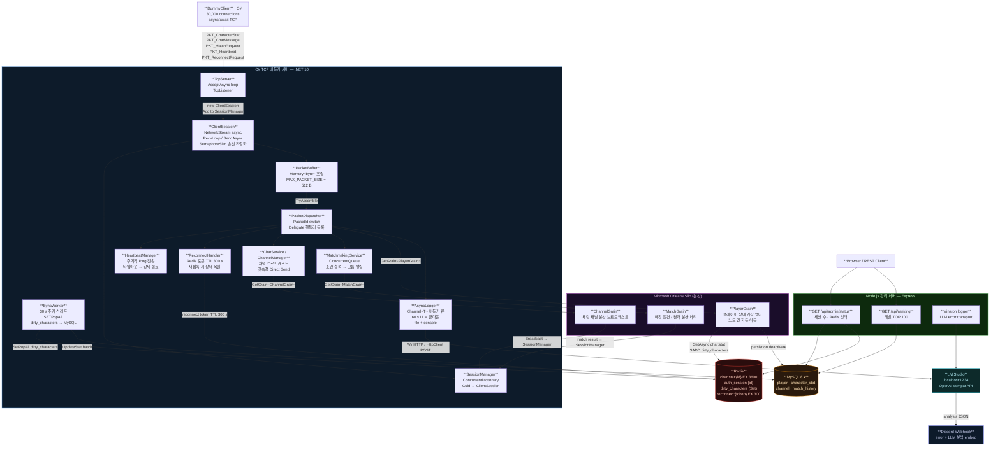

# GAME-Server-CSharp

C# 기반 비동기 분산 게임 서버 포트폴리오

**기간**: 2026.06.24 ~ 2026.08.24

---

## 기술 스택

| 분류 | 기술 |
|---|---|
| 언어 / 플랫폼 | C# / .NET 10.0 |
| 네트워크 | TCP 소켓 (async/await) |
| 분산 처리 | Microsoft Orleans |
| DB | MySQL 8.x, Redis |
| 관리 서버 | Node.js, Express |
| 배포 | Docker, Docker Compose |
| AI 연동 | 로컬 LLM (에러 로그 분석) |

---

## 목표

- 3만명 더미 클라이언트 동시접속
- Orleans 기반 분산 서버 Docker 시연
- 모바일 게임 서버 특화 기능 구현

---

## 개발 단계

### Phase 1 — TCP 비동기 서버 기반 구축
- async/await 기반 TCP 소켓 서버
- 세션 관리, 패킷 핸들러

### Phase 2 — DB 설정
- MySQL 커넥션 풀
- Redis 캐싱, 세션 관리

### Phase 3 — 게임 서버 기능
- 채팅 (채널, 귓속말)
- 매칭 시스템
- 재접속 처리
- 하트비트

### Phase 4 — Orleans 분산 처리 + Docker
- Orleans 클러스터 구성
- Docker Compose로 서버 여러 대 시연

### Phase 5 — 스트레스 테스트
- 더미 클라이언트 3만명 동시접속 테스트
- 병목 분석 및 버그 수정

### Phase 6 — 관리 서버 + LLM 연동
- Node.js REST API
- 로컬 LLM 에러 로그 분석 파이프라인

---

## 전체 구조 흐름도 (초안)

---

## 핵심 설계 결정

| 항목 | C++ 버전 | C# 버전 | 이유 |
|------|----------|---------|------|
| 네트워크 모델 | IOCP + OVERLAPPED | async/await TcpClient | .NET 런타임이 내부적으로 IOCP 사용 |
| 분산 처리 | 없음 (단일 프로세스) | Microsoft Orleans | 가상 액터(Grain)로 수평 확장 |
| 버퍼 조립 | RingBuffer (C++) | PacketBuffer (Memory~byte~) | Span/Memory로 제로카피 |
| 동시성 | shared_mutex, atomic | ConcurrentDictionary, SemaphoreSlim | C# 런타임 동시성 기본 제공 |
| 재접속 | 없음 | ReconnectHandler (Redis TTL 300s) | 모바일 네트워크 단절 대응 |
| 채팅 | 없음 | ChatService + ChannelGrain | 게임 서버 특화 기능 |
| 배포 | 단일 exe | Docker Compose (멀티 Silo) | Orleans 클러스터 시연 |

---

## 업로드 일지

| 날짜 | 내용 |
|------|------|
| 2026.06.24 | 프로젝트 시작 — 목표 설정 및 방향성 정의 |
| 2026.06.26 | 전체 흐름도 · 클래스 다이어그램 · 시퀀스 다이어그램 초안 추가 |
| 2026.06.27 | DB 레이어 클래스 다이어그램 및 ERD 추가, 아이템/길드/인벤토리 구조 설계, DB 스키마 SQL 추가 |
| 2026.06.29 | Phase 1 TCP 비동기 서버 기반 구현 |
| 2026.06.30 | Phase 2 DB 설정 — MySQL 커넥션 풀, Redis 캐싱, SyncWorker |

---

## GitHub

[RPG_Game_Server_Portfolio-2026 (C++ 버전)](https://github.com/Sewqp/RPG_Game_Server_Portfolio-2026)
