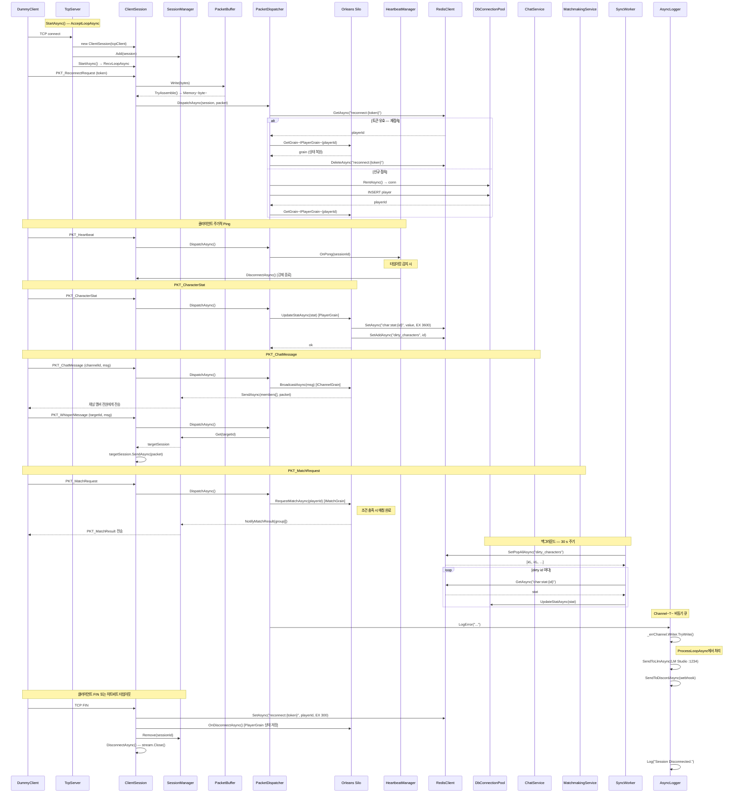
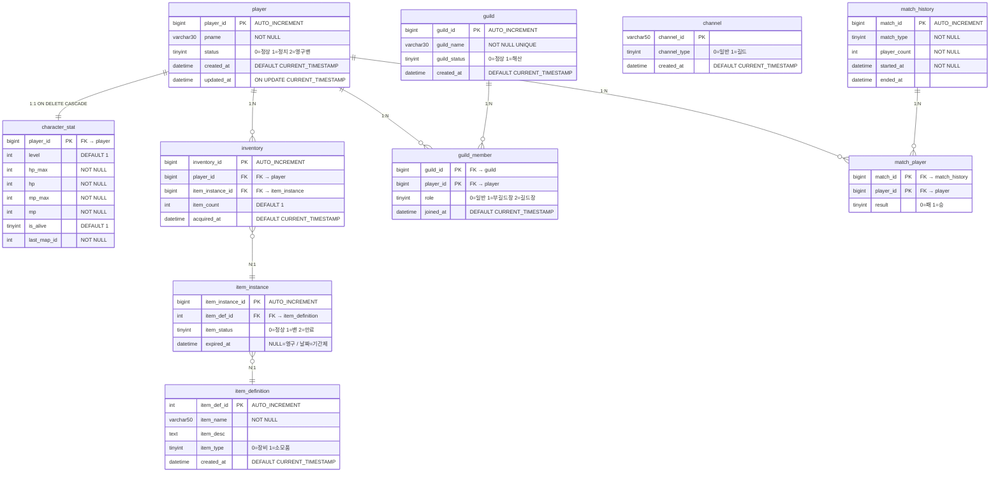

# Architecture — RPG-Server-CSharp

---

## Class Diagram

```mermaid
classDiagram
    class TcpServer {
        -TcpListener _listener
        -CancellationTokenSource _cts
        +TcpServer(port int)
        +StartAsync() Task
        +StopAsync() Task
        -AcceptLoopAsync() Task
    }

    class ClientSession {
        -TcpClient _client
        -NetworkStream _stream
        -Guid _sessionId
        -PacketBuffer _recvBuffer
        -SemaphoreSlim _sendLock
        -CancellationToken _ct
        +SessionId : Guid
        +PlayerId : long
        +StartAsync() Task
        +SendAsync(data byte[]) Task
        +DisconnectAsync() Task
        -RecvLoopAsync() Task
    }

    class PacketBuffer {
        -byte[] _buffer
        -int _writePos
        -int _readPos
        +MAX_PACKET_SIZE = 512
        +Write(span ReadOnlySpan~byte~) bool
        +TryAssemble() Memory~byte~?
        +GetReadableSize() int
    }

    class PacketHeader {
        <<struct>>
        +ushort Size
        +PacketId Id
    }

    class PacketId {
        <<enumeration>>
        CharacterInfo = 1002
        CharacterStat = 1003
        EnterRoom = 1008
        LeaveRoom = 1009
        ChatMessage = 2000
        WhisperMessage = 2001
        MatchRequest = 3000
        MatchResult = 3001
        Heartbeat = 9000
        ReconnectRequest = 9001
    }

    class PacketDispatcher {
        <<Singleton>>
        -Dictionary~PacketId,Func~ _handlers
        +Register(id, handler)
        +DispatchAsync(session, packet Memory~byte~) Task
    }

    class SessionManager {
        <<Singleton>>
        -ConcurrentDictionary~Guid,ClientSession~ _sessions
        +Add(session ClientSession)
        +Remove(sessionId Guid)
        +Get(sessionId Guid) ClientSession?
        +BroadcastAsync(data byte[]) Task
        +Count : int
    }

    class HeartbeatManager {
        -TimeSpan _interval
        -TimeSpan _timeout
        -ConcurrentDictionary~Guid,DateTime~ _lastPong
        +OnPong(sessionId Guid)
        +StartAsync(ct) Task
        -CheckLoopAsync() Task
    }

    class ReconnectHandler {
        -IDatabase _redis
        -TimeSpan _tokenTtl
        +TOKEN_TTL = 300s
        +SaveTokenAsync(token, playerId) Task
        +ValidateAsync(token) long?
        +ClearAsync(token) Task
    }

    class ChatService {
        -ChannelManager _channels
        +SendChannelAsync(channelId, senderId, msg) Task
        +SendWhisperAsync(targetId, senderId, msg) Task
    }

    class ChannelManager {
        -ConcurrentDictionary~string,HashSet~Guid~~ _channels
        +Join(channelId string, sessionId Guid)
        +Leave(channelId string, sessionId Guid)
        +GetMembers(channelId string) IEnumerable~Guid~
    }

    class MatchmakingService {
        -ConcurrentQueue~MatchRequest~ _queue
        +EnqueueAsync(request MatchRequest) Task
        -MatchLoopAsync() Task
        -NotifyResultAsync(group List~Guid~) Task
    }

    class DbConnectionPool {
        -SemaphoreSlim _semaphore
        -Stack~MySqlConnection~ _pool
        +POOL_SIZE = 10
        +Init(connStr string)
        +RentAsync() MySqlConnection
        +Return(conn MySqlConnection)
    }

    class RedisClient {
        <<Singleton>>
        -ConnectionMultiplexer _mux
        -IDatabase _db
        +Init(connStr string)
        +SetAsync(key, value, expiry) Task
        +GetAsync(key string) string?
        +DeleteAsync(key string) Task
        +SetAddAsync(key, member) Task
        +SetPopAllAsync(key string) string[]
    }

    class SyncWorker {
        -TimeSpan _interval
        +SYNC_INTERVAL = 30s
        +StartAsync() Task
        +StopAsync() Task
        -FlushDirtyAsync() Task
    }

    class IPlayerGrain {
        <<interface>>
        +GetStateAsync() Task~PlayerState~
        +UpdateStatAsync(stat) Task
        +SendMessageAsync(msg string) Task
        +OnDisconnectAsync() Task
    }

    class PlayerGrain {
        -PlayerState _state
        +OnActivateAsync(ct) Task
        +OnDeactivateAsync(reason, ct) Task
        +GetStateAsync() Task~PlayerState~
        +UpdateStatAsync(stat) Task
        +SendMessageAsync(msg string) Task
    }

    class IChannelGrain {
        <<interface>>
        +JoinAsync(playerId long) Task
        +LeaveAsync(playerId long) Task
        +BroadcastAsync(msg string) Task
    }

    class IMatchGrain {
        <<interface>>
        +RequestMatchAsync(playerId long) Task
        +CancelMatchAsync(playerId long) Task
    }

    class AsyncLogger {
        <<Singleton>>
        -Channel~string~ _logChannel
        -Channel~string~ _errChannel
        -string _llmEndpoint
        -string _discordWebhook
        -DateTime _lastLlmSend
        +LLM_COOLDOWN = 60s
        +Configure(llmEndpoint, discordWebhook)
        +Log(message string)
        +LogError(message string)
        -ProcessLoopAsync() Task
        -SendToLlmAsync(error string) Task
        -SendToDiscordAsync(error, analysis) Task
    }

    %% Relationships
    TcpServer ..> ClientSession : creates
    TcpServer ..> SessionManager : Add
    ClientSession *-- PacketBuffer : _recvBuffer
    ClientSession ..> PacketDispatcher : DispatchAsync
    SessionManager o-- ClientSession : _sessions
    PacketDispatcher ..> ChatService : uses
    PacketDispatcher ..> MatchmakingService : uses
    PacketDispatcher ..> HeartbeatManager : uses
    PacketDispatcher ..> ReconnectHandler : uses
    PacketDispatcher ..> DbConnectionPool : uses
    PacketDispatcher ..> RedisClient : uses
    PacketDispatcher ..> AsyncLogger : uses
    PacketDispatcher ..> IPlayerGrain : GetGrain
    PacketDispatcher ..> IChannelGrain : GetGrain
    PacketDispatcher ..> IMatchGrain : GetGrain
    ChatService *-- ChannelManager : _channels
    ChatService ..> IChannelGrain : delegates
    MatchmakingService ..> SessionManager : notify
    MatchmakingService ..> IMatchGrain : delegates
    HeartbeatManager ..> SessionManager : Disconnect
    ReconnectHandler ..> RedisClient : token TTL
    SyncWorker ..> RedisClient : SetPopAll dirty
    SyncWorker ..> DbConnectionPool : UpdateStat
    PlayerGrain ..|> IPlayerGrain
    PlayerGrain ..> RedisClient : stat cache
    PacketHeader --> PacketId : Id
```

---

## Sequence Diagram — 접속부터 종료까지

```mermaid
sequenceDiagram
    participant C  as DummyClient
    participant TS as TcpServer
    participant CS as ClientSession
    participant SM as SessionManager
    participant PB as PacketBuffer
    participant PD as PacketDispatcher
    participant OR as Orleans Silo
    participant HB as HeartbeatManager
    participant RD as RedisClient
    participant DB as DbConnectionPool
    participant CHAT as ChatService
    participant MM as MatchmakingService
    participant SW as SyncWorker
    participant LOG as AsyncLogger

    Note over TS: StartAsync() — AcceptLoopAsync

    %% ── 1. TCP 접속 ───────────────────────────────────────────
    C  ->> TS : TCP connect
    TS ->> CS : new ClientSession(tcpClient)
    TS ->> SM : Add(session)
    TS ->> CS : StartAsync() → RecvLoopAsync

    %% ── 2. 재접속 or 신규 진입 ───────────────────────────────
    C  ->> CS : PKT_ReconnectRequest (token)
    CS ->> PB : Write(bytes)
    PB -->> CS : TryAssemble() → Memory~byte~
    CS ->> PD : DispatchAsync(session, packet)
    PD ->> RD : GetAsync("reconnect:{token}")
    alt 토큰 유효 — 재접속
        RD -->> PD : playerId
        PD ->> OR : GetGrain~IPlayerGrain~(playerId)
        OR -->> PD : grain (상태 복원)
        PD ->> RD : DeleteAsync("reconnect:{token}")
    else 신규 접속
        PD ->> DB : RentAsync() → conn
        PD ->> DB : INSERT player
        DB -->> PD : playerId
        PD ->> OR : GetGrain~IPlayerGrain~(playerId)
    end

    %% ── 3. 하트비트 ───────────────────────────────────────────
    Note over C,HB: 클라이언트 주기적 Ping
    C  ->> CS : PKT_Heartbeat
    CS ->> PD : DispatchAsync()
    PD ->> HB : OnPong(sessionId)

    Note over HB: 타임아웃 감지 시
    HB ->> CS : DisconnectAsync() [강제 종료]

    %% ── 4. 캐릭터 스탯 업데이트 (Write-Through) ──────────────
    Note over C,OR: PKT_CharacterStat
    C  ->> CS : PKT_CharacterStat
    CS ->> PD : DispatchAsync()
    PD ->> OR : UpdateStatAsync(stat) [PlayerGrain]
    OR ->> RD : SetAsync("char:stat:{id}", value, EX 3600)
    OR ->> RD : SetAddAsync("dirty_characters", id)
    OR -->> PD : ok

    %% ── 5. 채팅 ───────────────────────────────────────────────
    Note over C,CHAT: PKT_ChatMessage
    C  ->> CS : PKT_ChatMessage (channelId, msg)
    CS ->> PD : DispatchAsync()
    PD ->> OR : BroadcastAsync(msg) [IChannelGrain]
    OR -->> SM : SendAsync(members[], packet)
    SM -->> C  : 채널 멤버 전원에게 전송

    %% ── 6. 귓속말 ─────────────────────────────────────────────
    C  ->> CS : PKT_WhisperMessage (targetId, msg)
    CS ->> PD : DispatchAsync()
    PD ->> SM : Get(targetId)
    SM -->> CS : targetSession
    CS ->> CS : targetSession.SendAsync(packet)

    %% ── 7. 매칭 ───────────────────────────────────────────────
    Note over C,MM: PKT_MatchRequest
    C  ->> CS : PKT_MatchRequest
    CS ->> PD : DispatchAsync()
    PD ->> OR : RequestMatchAsync(playerId) [IMatchGrain]
    Note right of OR: 조건 충족 시 매칭 완료
    OR -->> SM : NotifyMatchResult(group[])
    SM -->> C  : PKT_MatchResult 전송

    %% ── 8. SyncWorker 30초 주기 동기화 ───────────────────────
    Note over SW,DB: 백그라운드 — 30 s 주기
    SW ->> RD : SetPopAllAsync("dirty_characters")
    RD -->> SW : [id₁, id₂, ...]
    loop dirty id 마다
        SW ->> RD : GetAsync("char:stat:{id}")
        RD -->> SW : stat
        SW ->> DB : UpdateStatAsync(stat)
    end

    %% ── 9. 에러 파이프라인 ────────────────────────────────────
    Note over LOG: Channel~T~ 비동기 큐
    PD ->> LOG : LogError("...")
    LOG ->> LOG : _errChannel.Writer.TryWrite()
    Note right of LOG: ProcessLoopAsync에서 처리
    LOG ->> LOG : SendToLlmAsync(LM Studio :1234)
    LOG ->> LOG : SendToDiscordAsync(webhook)

    %% ── 10. 연결 종료 ─────────────────────────────────────────
    Note over C,SM: 클라이언트 FIN 또는 하트비트 타임아웃
    C  ->> CS : TCP FIN
    CS ->> RD : SetAsync("reconnect:{token}", playerId, EX 300)
    CS ->> OR : OnDisconnectAsync() [PlayerGrain 상태 저장]
    CS ->> SM : Remove(sessionId)
    CS ->> CS : DisconnectAsync() — stream.Close()
    LOG ->> LOG : Log("Session Disconnected.")
```

---

## DB Layer Class Diagram

```mermaid
classDiagram
    class DbConnectionPool {
        -SemaphoreSlim _semaphore
        -Stack~MySqlConnection~ _pool
        +POOL_SIZE = 10
        +Init(connStr string)
        +RentAsync() Task~MySqlConnection~
        +Return(conn MySqlConnection)
    }

    class RedisClient {
        <<Singleton>>
        -ConnectionMultiplexer _mux
        -IDatabase _db
        +Init(connStr string)
        +SetAsync(key string, value string, expiry TimeSpan) Task
        +GetAsync(key string) Task~string?~
        +DeleteAsync(key string) Task
        +SetAddAsync(key string, member string) Task
        +SetPopAllAsync(key string) Task~string[]~
    }

    class SyncWorker {
        -DbConnectionPool _dbPool
        -RedisClient _redis
        -TimeSpan _interval
        +SYNC_INTERVAL = 30s
        +StartAsync() Task
        +StopAsync() Task
        -FlushDirtyAsync() Task
    }

    %% ── Repositories ───────────────────────────────────────────
    class PlayerRepository {
        -DbConnectionPool _pool
        +InsertAsync(player PlayerModel) Task~long~
        +FindByIdAsync(playerId long) Task~PlayerModel?~
        +UpdateStatusAsync(playerId long, status byte) Task
    }

    class CharacterStatRepository {
        -DbConnectionPool _pool
        +InsertAsync(stat CharacterStatModel) Task
        +FindByPlayerIdAsync(playerId long) Task~CharacterStatModel?~
        +UpdateAsync(stat CharacterStatModel) Task
        +BatchUpdateAsync(stats List~CharacterStatModel~) Task
    }

    class ItemDefinitionRepository {
        -DbConnectionPool _pool
        +InsertAsync(def ItemDefinitionModel) Task~int~
        +FindByIdAsync(itemDefId int) Task~ItemDefinitionModel?~
        +GetAllAsync() Task~List~ItemDefinitionModel~~
    }

    class ItemInstanceRepository {
        -DbConnectionPool _pool
        +InsertAsync(inst ItemInstanceModel) Task~long~
        +FindByIdAsync(instanceId long) Task~ItemInstanceModel?~
        +UpdateStatusAsync(instanceId long, status byte) Task
    }

    class InventoryRepository {
        -DbConnectionPool _pool
        +InsertAsync(inv InventoryModel) Task~long~
        +FindByPlayerIdAsync(playerId long) Task~List~InventoryModel~~
        +UpdateCountAsync(inventoryId long, count int) Task
        +DeleteAsync(inventoryId long) Task
    }

    class GuildRepository {
        -DbConnectionPool _pool
        +InsertAsync(guild GuildModel) Task~long~
        +FindByIdAsync(guildId long) Task~GuildModel?~
        +UpdateStatusAsync(guildId long, status byte) Task
        +GetMembersAsync(guildId long) Task~List~GuildMemberModel~~
        +AddMemberAsync(member GuildMemberModel) Task
        +RemoveMemberAsync(guildId long, playerId long) Task
    }

    class ChannelRepository {
        -DbConnectionPool _pool
        +InsertAsync(channel ChannelModel) Task
        +FindByIdAsync(channelId string) Task~ChannelModel?~
        +GetAllAsync() Task~List~ChannelModel~~
    }

    class MatchRepository {
        -DbConnectionPool _pool
        +InsertMatchAsync(match MatchHistoryModel) Task~long~
        +InsertMatchPlayersAsync(matchId long, players List~MatchPlayerModel~) Task
        +GetRecentByPlayerAsync(playerId long) Task~List~MatchHistoryModel~~
    }

    %% ── Models ─────────────────────────────────────────────────
    class PlayerModel {
        +long PlayerId
        +string Pname
        +byte Status
        +DateTime CreatedAt
        +DateTime UpdatedAt
    }

    class CharacterStatModel {
        +long PlayerId
        +int Level
        +int HpMax
        +int Hp
        +int MpMax
        +int Mp
        +bool IsAlive
        +int LastMapId
    }

    class ItemDefinitionModel {
        +int ItemDefId
        +string ItemName
        +string ItemDesc
        +byte ItemType
        +DateTime CreatedAt
    }

    class ItemInstanceModel {
        +long ItemInstanceId
        +int ItemDefId
        +byte ItemStatus
        +DateTime? ExpiredAt
    }

    class InventoryModel {
        +long InventoryId
        +long PlayerId
        +long ItemInstanceId
        +int ItemCount
        +DateTime AcquiredAt
    }

    class GuildModel {
        +long GuildId
        +string GuildName
        +byte GuildStatus
        +DateTime CreatedAt
    }

    class GuildMemberModel {
        +long GuildId
        +long PlayerId
        +byte Role
        +DateTime JoinedAt
    }

    class ChannelModel {
        +string ChannelId
        +byte ChannelType
        +DateTime CreatedAt
    }

    class MatchHistoryModel {
        +long MatchId
        +byte MatchType
        +int PlayerCount
        +DateTime StartedAt
        +DateTime EndedAt
    }

    class MatchPlayerModel {
        +long MatchId
        +long PlayerId
        +byte Result
    }

    %% ── Relationships ───────────────────────────────────────────
    SyncWorker --> DbConnectionPool : uses
    SyncWorker --> RedisClient : SetPopAllAsync dirty_characters

    PlayerRepository --> DbConnectionPool : RentAsync / Return
    CharacterStatRepository --> DbConnectionPool : RentAsync / Return
    ItemDefinitionRepository --> DbConnectionPool : RentAsync / Return
    ItemInstanceRepository --> DbConnectionPool : RentAsync / Return
    InventoryRepository --> DbConnectionPool : RentAsync / Return
    GuildRepository --> DbConnectionPool : RentAsync / Return
    ChannelRepository --> DbConnectionPool : RentAsync / Return
    MatchRepository --> DbConnectionPool : RentAsync / Return

    PlayerRepository ..> PlayerModel : returns
    CharacterStatRepository ..> CharacterStatModel : returns
    ItemDefinitionRepository ..> ItemDefinitionModel : returns
    ItemInstanceRepository ..> ItemInstanceModel : returns
    InventoryRepository ..> InventoryModel : returns
    GuildRepository ..> GuildModel : returns
    GuildRepository ..> GuildMemberModel : returns
    ChannelRepository ..> ChannelModel : returns
    MatchRepository ..> MatchHistoryModel : returns
    MatchRepository ..> MatchPlayerModel : returns

    CharacterStatModel --> PlayerModel : PlayerId FK
    InventoryModel --> PlayerModel : PlayerId FK
    InventoryModel --> ItemInstanceModel : ItemInstanceId FK
    ItemInstanceModel --> ItemDefinitionModel : ItemDefId FK
    GuildMemberModel --> GuildModel : GuildId FK
    GuildMemberModel --> PlayerModel : PlayerId FK
    MatchPlayerModel --> MatchHistoryModel : MatchId FK
    MatchPlayerModel --> PlayerModel : PlayerId FK
```

---

## ERD — MySQL 테이블 관계

```mermaid
erDiagram
    player {
        bigint      player_id   PK  "AUTO_INCREMENT"
        varchar30   pname           "NOT NULL"
        tinyint     status          "0=정상 1=정지 2=영구밴"
        datetime    created_at      "DEFAULT CURRENT_TIMESTAMP"
        datetime    updated_at      "ON UPDATE CURRENT_TIMESTAMP"
    }

    character_stat {
        bigint  player_id   PK  "FK → player"
        int     level           "DEFAULT 1"
        int     hp_max          "NOT NULL"
        int     hp              "NOT NULL"
        int     mp_max          "NOT NULL"
        int     mp              "NOT NULL"
        tinyint is_alive        "DEFAULT 1"
        int     last_map_id     "NOT NULL"
    }

    item_definition {
        int         item_def_id     PK  "AUTO_INCREMENT"
        varchar50   item_name           "NOT NULL"
        text        item_desc
        tinyint     item_type           "0=장비 1=소모품"
        datetime    created_at          "DEFAULT CURRENT_TIMESTAMP"
    }

    item_instance {
        bigint      item_instance_id    PK  "AUTO_INCREMENT"
        int         item_def_id         FK  "FK → item_definition"
        tinyint     item_status             "0=정상 1=밴 2=만료"
        datetime    expired_at              "NULL=영구 / 날짜=기간제"
    }

    inventory {
        bigint      inventory_id        PK  "AUTO_INCREMENT"
        bigint      player_id           FK  "FK → player"
        bigint      item_instance_id    FK  "FK → item_instance"
        int         item_count              "DEFAULT 1"
        datetime    acquired_at             "DEFAULT CURRENT_TIMESTAMP"
    }

    guild {
        bigint      guild_id    PK  "AUTO_INCREMENT"
        varchar30   guild_name      "NOT NULL UNIQUE"
        tinyint     guild_status    "0=정상 1=해산"
        datetime    created_at      "DEFAULT CURRENT_TIMESTAMP"
    }

    guild_member {
        bigint  guild_id    PK  "FK → guild"
        bigint  player_id   PK  "FK → player"
        tinyint role            "0=일반 1=부길드장 2=길드장"
        datetime joined_at      "DEFAULT CURRENT_TIMESTAMP"
    }

    channel {
        varchar50   channel_id      PK
        tinyint     channel_type        "0=일반 1=길드"
        datetime    created_at          "DEFAULT CURRENT_TIMESTAMP"
    }

    match_history {
        bigint      match_id        PK  "AUTO_INCREMENT"
        tinyint     match_type          "NOT NULL"
        int         player_count        "NOT NULL"
        datetime    started_at          "NOT NULL"
        datetime    ended_at
    }

    match_player {
        bigint  match_id    PK  "FK → match_history"
        bigint  player_id   PK  "FK → player"
        tinyint result          "0=패 1=승"
    }

    player          ||--||  character_stat  : "1:1  ON DELETE CASCADE"
    player          ||--o{  inventory       : "1:N"
    player          ||--o{  guild_member    : "1:N"
    player          ||--o{  match_player    : "1:N"
    guild           ||--o{  guild_member    : "1:N"
    inventory       }o--||  item_instance   : "N:1"
    item_instance   }o--||  item_definition : "N:1"
    match_history   ||--o{  match_player    : "1:N"
```
